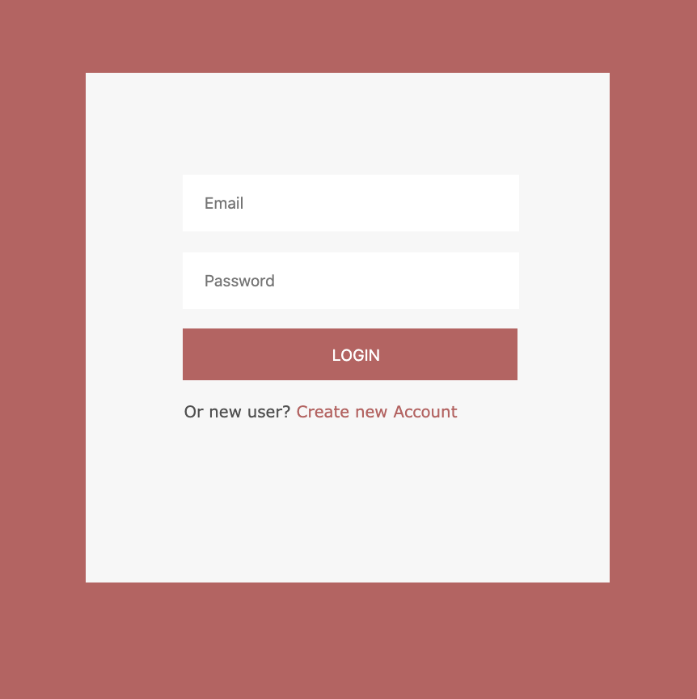
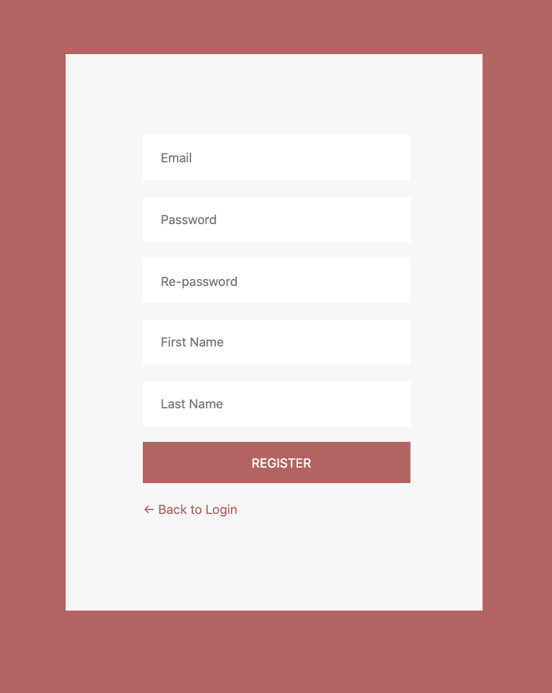
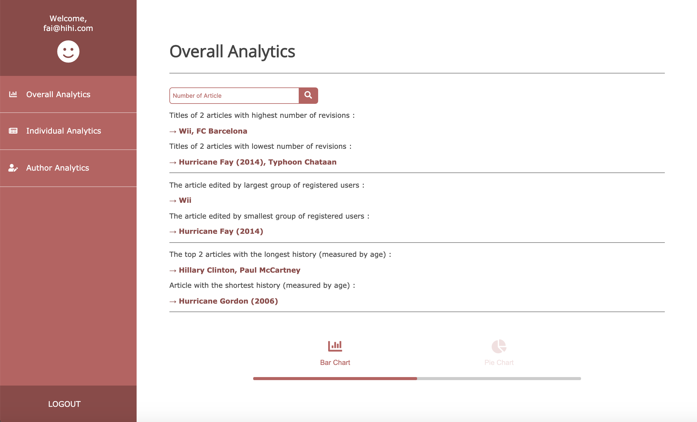
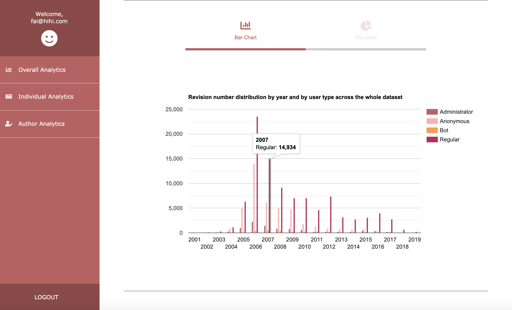
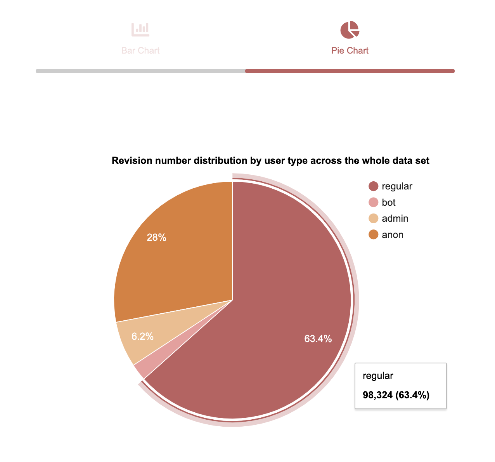
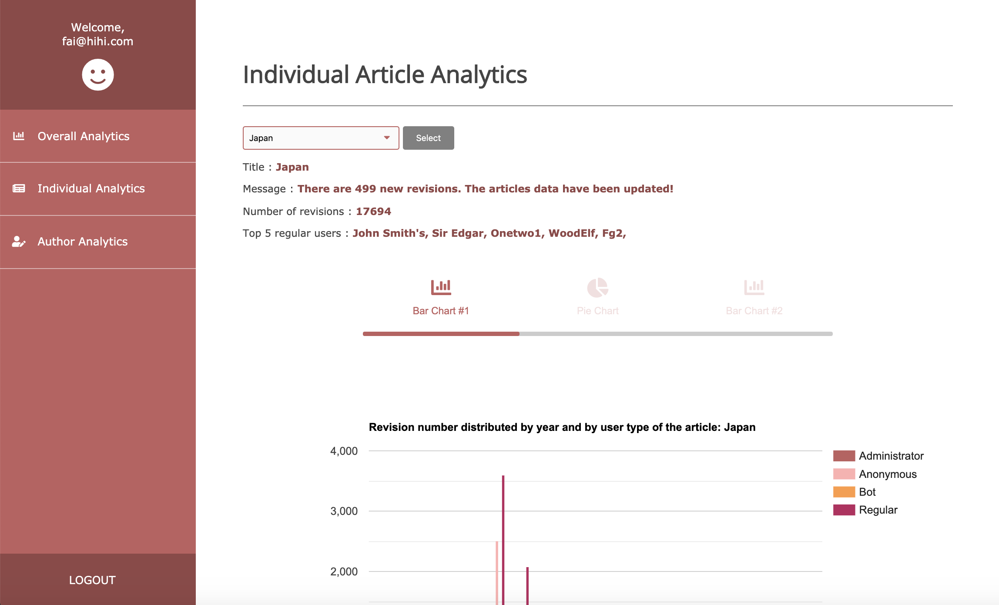
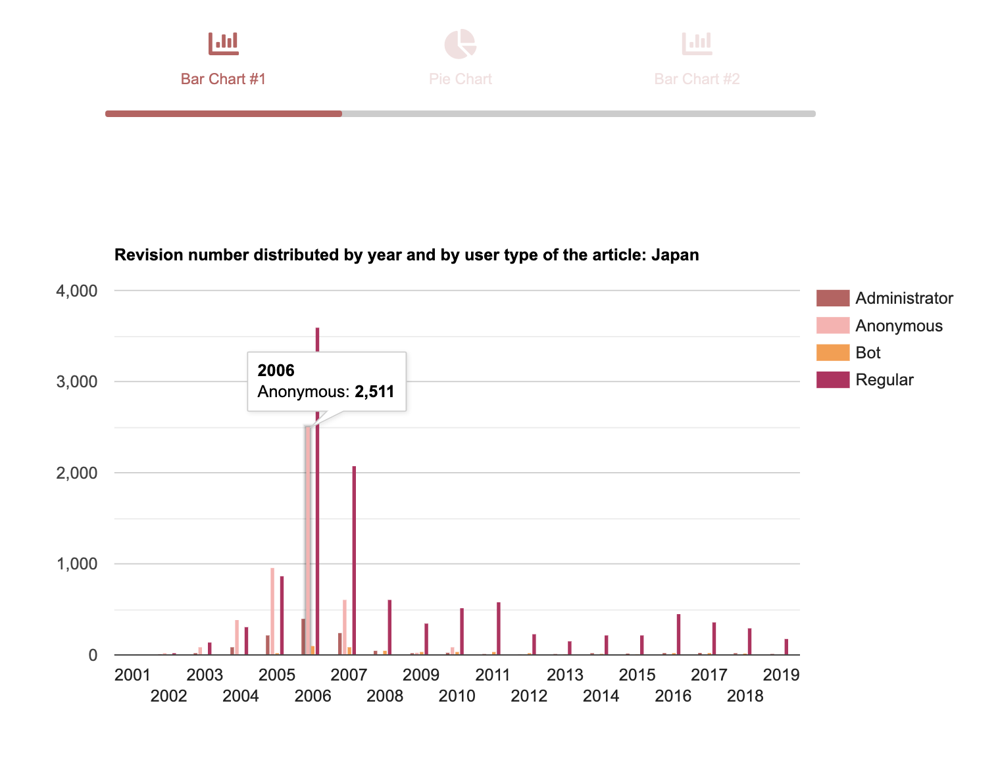
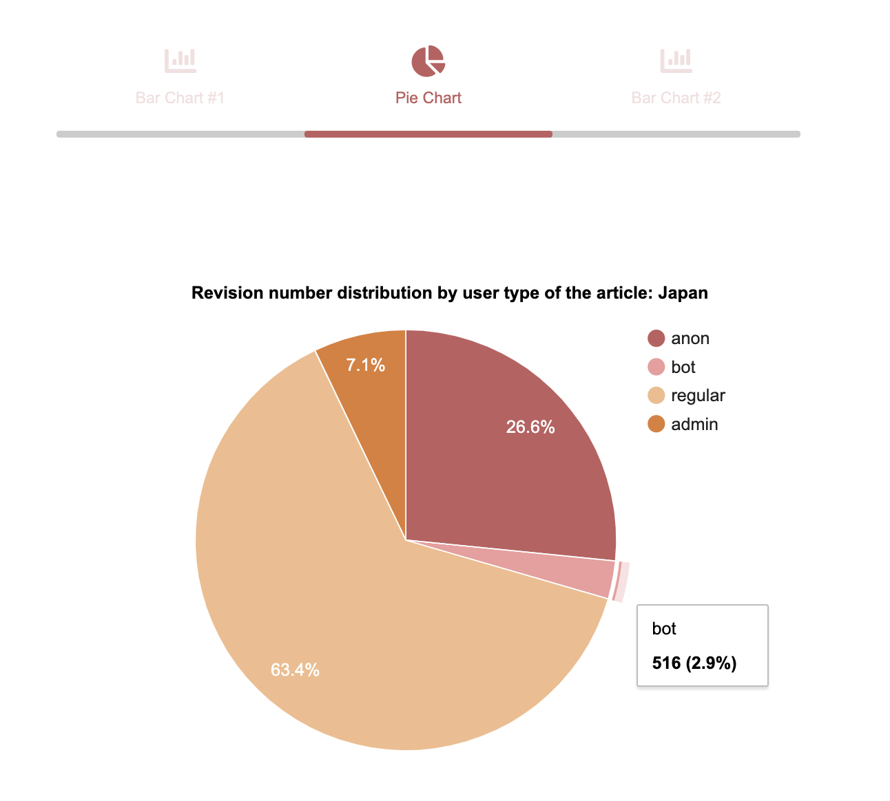
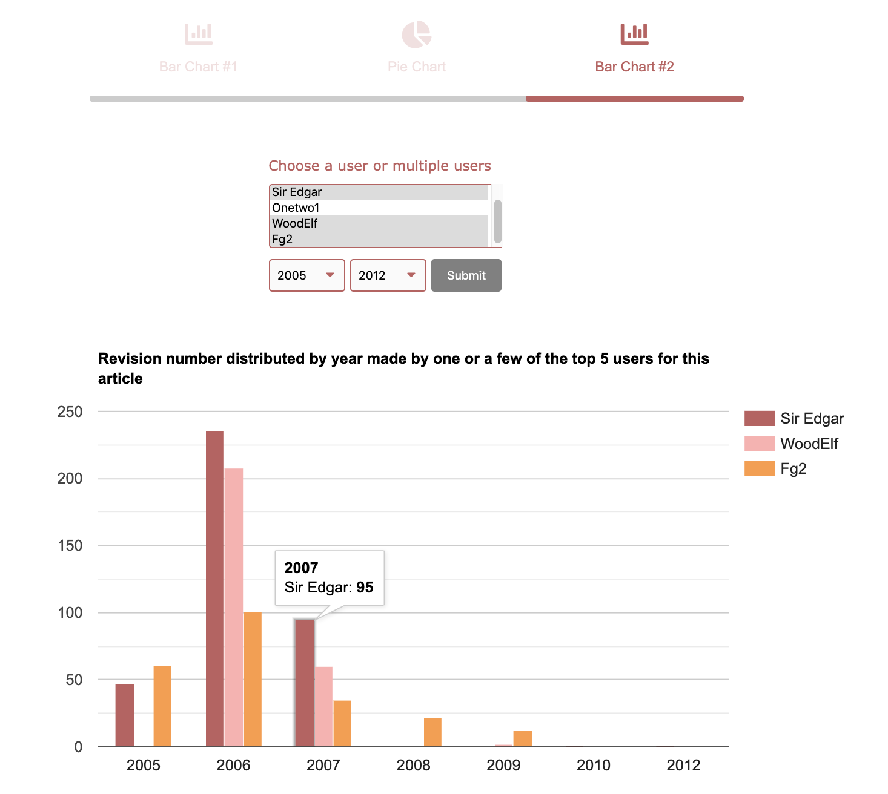
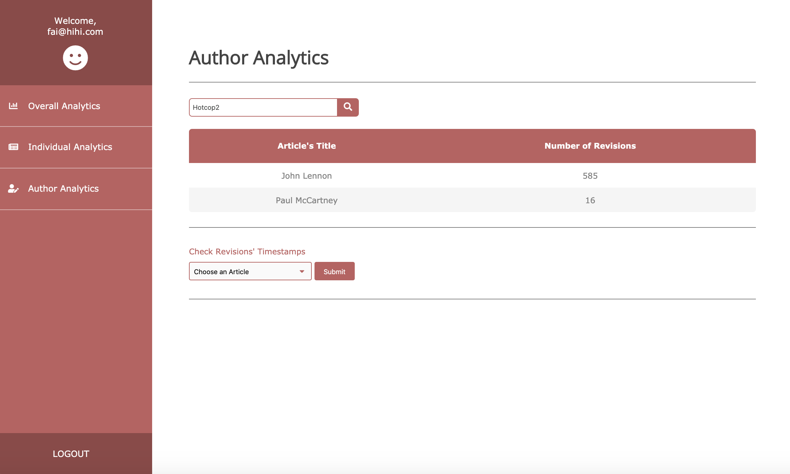

# Wikipedia Data Analytics

This project is created as a final project for Web Application Development course at University of Sydney. Our task is to build a single-page node.js data analytic web application to analyze the individual and overall articles of Wikipedia and their authors.

### Stack
* MVC architecture
* NodeJS
* Express
* MongoDB

## Features

### Login and Registration
User has to login or create new account before entering the main page of the application. As the project is in development environment, user information will be saved into the local database.

<p align="center">   </p>

### Overall Article Analytics
After user has logged in successfully, they will land on this page. This page shows the overall analytics of all provided Wikipedia articles.
** Sample dataset of articles is located in `app/import/dataset/revisions/`

<p align="center"></p>
<p align="center"></p>
<p align="center"></p>

### Individual Article Analytics
User can select an article to view the individual article analytics.

<p align="center"></p>
<p align="center"></p>

User can view the analytics on the revisions made by the authors of the article by selecting the author's name and the year range.

<p align="center"></p>

### Author analytics
User can view the analytics on an author and check the revisions' timestamps made by the author on a particular article.

<p align="center"></p>

## Setup

### Requirements

To run this project, you will need `Node.js` installed in your environment.

### Installing

Clone the project and run `npm install` in root directory

```
$ git clone https://github.com/faihihi/wikidata_analytics.git
$ npm install
```

### Configure the database

We have provided a sample dataset of Wikipedia revisions and list of admins and bots in the app/import/ directory. Before starting the server, you will need to import the dataset into the database and configure the database.

On terminal, go into the `app/import/` directory

```
$ cd app/import
```

Run the following commands in the import directory

```
$ node importJSON
$ node update
```
After the update of all 8 user types have been completed, force end the execution with  '^C'

## Running the project

`$ npm start`

## Notes
The project is forked from my University of Sydney Enterprise Github account (https://github.sydney.edu.au/jves0423).
